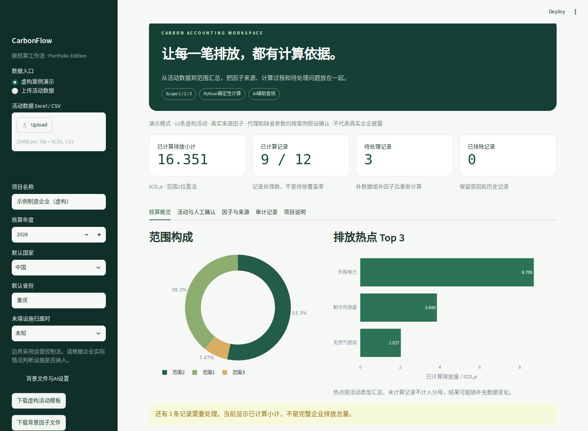

# CarbonFlow 企业碳核算工作流

把活动数据转成可复核的碳核算结果。上传Excel或CSV，系统归类范围1/2/3、匹配背景因子、换算单位并计算CO₂e。缺数据和缺因子会进入人工处理面板，结果保留来源和计算过程。

**求职作品定位**：双碳分析、ESG数据管理与AI应用的工程原型。使用虚构企业数据展示核算方法和软件实现，不代表真实企业披露、第三方核查或完整温室气体清单。



## 先运行，再看实现

要求Python 3.12。Windows用户解压项目后，先双击`setup_windows.bat`，再双击`run_windows.bat`。首次安装需要联网。运行后浏览器打开本地应用，默认展示12条虚构活动。

也可以在项目目录手动执行：

```bash
python -m venv .venv
# Windows PowerShell
.venv\Scripts\python.exe -m pip install -r requirements.txt
.venv\Scripts\python.exe -m streamlit run app.py
```

macOS或Linux用`.venv/bin/python`替换上面的Python路径。不要修改系统Python。

纯命令行也可以计算，不依赖浏览器和AI服务：

```bash
python -m carbonflow.cli --input examples/demo_activities.xlsx --output outputs
```

命令行会导出结果Excel、计算明细JSON、汇总JSON与审计JSONL。再次运行会重建当前结果，不把历史运行重复累加。

## 已实现的功能

| 功能 | 行为 |
| --- | --- |
| 数据输入 | Excel或UTF-8 CSV，最少需要活动名称、数量、单位 |
| 组织范围 | 先核对设施归属和用途，再执行Excel中的关键词规则 |
| 因子匹配 | 活动与物质、方法、地区、年份及来源筛选，支持人工确认 |
| 单位换算 | 同量纲换算，以及有参数依据的密度、人公里和吨公里计算 |
| GWP | 区分CO₂、明确气体质量与已有CO₂e，避免重复折算 |
| 缺口处理 | 分开显示待确认、待补数据、待补因子及无效输入 |
| 电力 | 默认位置法，另有中国购电假设情景，不充当实际市场法 |
| 结果展示 | 范围构成、Top3热点、逐行计算与来源 |
| 导出审计 | Excel包含因子和GWP快照，JSONL记录每个计算步骤 |
| 可选AI | 只从有限候选中提出建议，白名单校验，人工确认后才计算 |

## 示例结果

自带示例的12条活动全部为虚构，因子摘自已核对的公开来源。

| 项目 | 结果 |
| --- | ---: |
| 已计算记录 | 9条 |
| 待处理记录 | 3条 |
| 范围1小计 | 6,420.24760 kgCO₂e |
| 范围2位置法小计 | 8,709.00000 kgCO₂e |
| 范围3小计 | 1,221.94986 kgCO₂e |
| 已计算排放小计 | 16,351.19746 kgCO₂e |

三个待处理记录分别是用途不明确的柴油、缺少适用因子的中国高铁，以及第一版未覆盖的纸张采购。没有将它们当作零排放。9/12是记录处理比例，不是企业排放覆盖率。

示例采用AR5的100年GWP。燃料CO₂因子未自动补齐CH₄和N₂O。英国因子用于示例中的供水、货运、废物和国际航空时，已在虚构案例中明确接受代理及适用条件，这些确认不能直接复制到真实业务中。

## 计算过程

1. 读取活动与项目设置，保留原始记录标识。
2. 按边界和用途归类，再匹配因子候选。
3. 把活动量换成因子的分母单位，缺参数时停止该条记录。
4. Python计算并按需要乘GWP，已有CO₂e不重复转换。
5. 分范围汇总当前有效结果，缺口与假设单独展示。
6. 导出结果和审计记录，用户补充信息后重新计算。

计算、规则执行和AI建议分开。AI不能生成因子，也不能决定最终数值。没有API Key时，除AI建议以外的功能均可运行。

## 项目结构

- `app.py`：Streamlit界面和交互。
- `carbonflow/`：数据、规则、单位、匹配、运算、审计、AI与命令行模块。
- `data/carbon_data.xlsx`：运行用背景文件，包含52条精选因子、29条规则和21条GWP记录。
- `data/catalog_seed.json`：可审查的公开因子种子及来源定位。
- `examples/demo_activities.xlsx`：虚构活动输入。
- `examples/demo_results.xlsx`：已生成的虚构案例结果，可先打开查看。
- `scripts/build_data.py`：从种子重建背景文件和虚构示例，会覆盖对应文件。
- `tests/`：核心规则、异常情况、AI约束和界面测试。
- `docs/`：数据说明、演示讲稿、简历表述和验证记录。
- `.github/workflows/tests.yml`：Windows与Linux的Python 3.12测试任务。

## 活动数据怎么准备

三列必填：`活动名称`、`数量`、`单位`。数量必须为非负有限数值。地区和设施归属等信息可在输入中提供，也可按需要在界面补充。

常用可选列：`设施归属`、`地区`、`国家`、`用途`、`密度kg/L`、`密度来源`、`人数`、`行程次数`、`载重t`、`确认适用条件`、`确认代理`、`确认泄漏量`。

设施归属取`边界内`、`边界外`或`未知`。燃料用途取`固定`或`移动`。确认列用`是`或`否`。如果燃油与里程分两行表示同一活动，可以赋予相同`计算组`，确认一种方法后把另一行标为不计入，并填写原因。

三列输入并不意味着系统可以猜测缺失的业务关系。必要信息不明时，程序会要求补充。

## 因子不够时怎么办

下载背景文件，按`docs/DATA.md`补充因子ID、活动类型、数值、单位、气体表示、来源、年份及条件。修改后从界面重新加载。程序不自动从互联网找数值并采用。

归类规则和排放因子均由Excel驱动。kg与t等标准物理换算在Python代码中实现。匹配不到时保留原活动，其他记录继续计算。正式市场法、完整行业工艺排放和完整范围3类别核算属于未来扩展。

## 可选AI配置

安装`requirements-ai.txt`后，将`.env.example`复制为`.env`，填写兼容Chat Completions接口的HTTPS基础地址、模型名与API Key。使用系统环境变量时不需要python-dotenv。

```bash
python -m pip install -r requirements-ai.txt
```

在界面勾选启用AI后，点击某条记录的建议按钮才发出请求。只发送该条描述、单位、设施归属、用途与候选摘要，不发送数量、企业名称或完整工作簿。返回JSON必须通过类别、范围和因子ID白名单校验。用户在表单确认后，确定性计算器仍会重新检查条件。

本项目验证了模拟接口、非法输出、无Key及失败路径，未配置真实付费API做集成调用。不使用AI调用次数或准确率作为未经实测的成果。

## 测试

```bash
python -m pip install -r requirements-dev.txt
python -m pytest -q
```

测试使用独立写出的期望算式，覆盖缺因子、零与缺失、CO₂e重复折算、GWP版本不一致、单位含义、地区回退、互斥记录、购电情景、Excel文本注入和AI非法ID。界面测试使用Streamlit AppTest。

实际验证环境和结果见`docs/VALIDATION.md`。Windows自动化测试已配置，但在首次上传并触发GitHub Actions之前，不声称远程Windows任务已通过。

## 上传GitHub

建议仓库名`carbon-accounting-workflow`，描述可写“企业Scope 1/2/3碳核算工作流，支持因子追溯、人工复核与可选AI建议”。

先在GitHub新建空仓库，再从项目目录执行以下命令，把最后两行中的地址替换成你自己的仓库地址：

```bash
git init
git add .
git commit -m "Build carbon accounting workflow MVP"
git branch -M main
git remote add origin YOUR_REPOSITORY_URL
git push -u origin main
```

上传前确认只包含公开背景数据和虚构示例。`.gitignore`已排除.env、虚拟环境、日志、输出文件及真实上传目录。不要把整个压缩包作为唯一源码文件上传，应先解压并上传项目内容。

## 面试演示

使用`docs/PORTFOLIO.md`中的三分钟讲稿。重点展示一条可追溯结果、一条待处理记录如何修正，以及为什么AI不能直接决定因子或算数。可公开展示当前软件原型，不能将虚构数据包装成服务真实企业的成果。

代码采用MIT许可，第三方数据与资料保留其来源要求。来源说明见`docs/DATA.md`。
